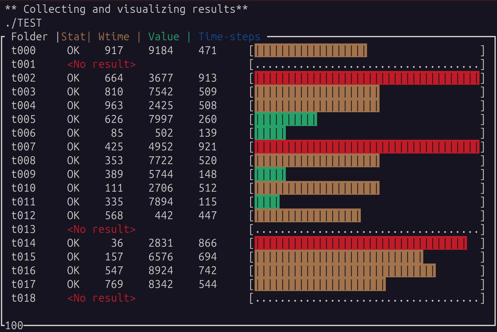

# Harvester for parametric study run
- For the study of parametric space, many runs/simulations are required
- Instead of checking each result from each folder, we provide convenient methods to check the sanity/results using:
    - Using Python curses: This will provide a simple dashboard, showing summary results on terminal. When cases fail, they will not produce summary.json and such cases are captured and displayed. This is for quick check of results/sanity of many cases
    - Using Python Bokeh: For pretty plots and decent dashboard. TBD
    
# Potential scenario
- Running Matlab or other simulation suites over many parametric spaces
- Inputs/job scheduler might be produced shell/python scripts
- Each folder has its own input/output and summary.json as final results. When a simulation fails, it may not produce summary.json or summary.json may not contain appropriate results/keywords
- harvester.py will scan the main folder (using --path option), finding subfolders and their summary.json
  - If time steps are too large (>500), the meter is colored as red
  - Missing folder/files are addressed with red-colored message
  - Per requests, more taylor/customization is possible but note that this tool is for quick-check. Any sophisticated features of dashboard would be featured in Python Bokeh dashboard

# Sample run
- mkdir TEST
- cd TEST
- python3 ../seeder.py # This will produce 100 folders with randomized results
- cd ..
- python3 ./harverster.py --path ./TEST # this will produce all_summary.json and list_broken.json at TEST folder

- Press 'q' to exit the dashboard
